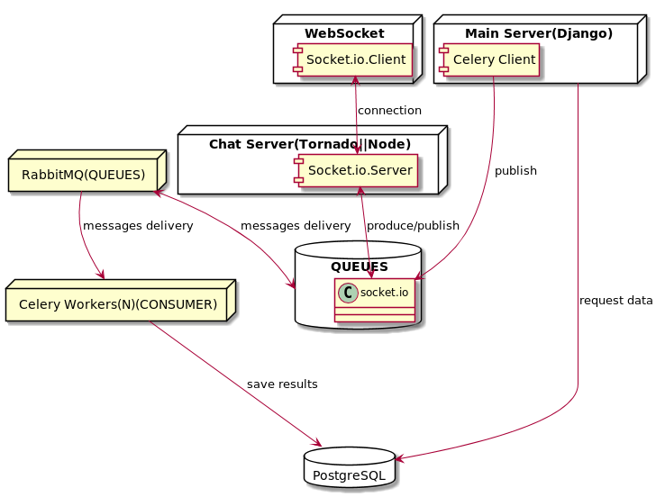
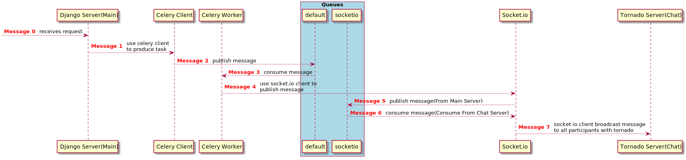

# messaging-with-rabbitmq
The aim of the project is to make a proof of concept for sentiment analyse(emotion AI) 
used for a chat with RabbitMQ as message broker. We want to recognize/show the emotions
of chat participants.

## concept

### generic view


### architecture


### messaging


### ai


## technological stack
Python 3.6.8 + requirements.txt
RabbitMQ 3.8.3 Erlang 22.3.2
PostgreSQL 10.9
Celery 4.4.2


## development
In order to quickly run needed services we use docker and docker-compose.
Execute from main directory, it will run postgresql and rabbitmq containers.
```bash
./docker/up.sh
```

In order to build web client application.
Install dependencies.
```bash
npm install
```
Run webpack-dev-server.
```bash
npm run webpack-dev-server
```
Install python project in development mode.
```bash
pip install -e .
```
Run migrations.
```bash
mwr-manage migrate
```
Create superuser.
```bash
mwr-manage createsuperuser
```
Create dump data.
```bash
mwr-manage populate_with_dump_data
```
Run django project.
```bash
mwr-manage runserver
```

Run tornado server
```bash
python src/chat_server/main.py
```

Run celery workers(we load tasks from main django project and chat server).
```bash
celery -A mwr worker -l debug -Q default
```

## test
After running docker-compose You should be able to run Celery and test script.

```bash
cd scripts
celery -A test worker --loglevel=info
```

```bash
cd scripts
python test.py
```

After that in Celery logs You will see a message that task was executed. PostgreSQL was used as
celery backend, You should see celery tables and existing records.

## proof of concept
I assume that all steps from development section are executed. Go to "http://localhost:8000" as You enter
a new websocket connection will be established with tornado server. Now in trigger this web request 
"http://localhost:8000/api/chat/testing/?format=json&message=testing message", the message will be displayed
in all opened windows. Instead of triggering web request, a python script maybe run too.
```bash
python scripts/socket-io-emit-test.py
```


## architectural explanation
We are doing messaging with RabbitMQ as message broker. RabbitMQ is used here for 2 purposes,
first we want to use it as publish/consume strategy with Celery to delegate heavy tasks to
Celery Workers, secondly we want to use it as notification queue together with python-socketio.

### messaging with python-socketio
python-socketio define a socketio.KombuManager class that can be used to publish messages to
RabbitMQ it sends messages on global channel socketio where each manager has its own queue 
defined, the type of exchange by default is **fanout**
(https://docs.celeryproject.org/projects/kombu/en/stable/reference/kombu.html#kombu.Exchange.type)
which means that all queues associated with exchange will get message.

### tornado chat server
Tornado is used as it support WebSocket. A websocket communication is handled by python-socketio AsyncServer
class instance which is used as handler to incoming websocket requests. In order to be able to communicate with
chat server from main server and Celery workers we will configure Socket.IO server and connect it to RabbitMQ
message queue. This will be achieved socketio manager class. KombuManager cannot be used as it doesn't support
asyncio mode(https://python-socketio.readthedocs.io/en/latest/server.html#kombu). We use AsyncAioPikaManager
(https://python-socketio.readthedocs.io/en/latest/server.html#aiopika).

## ai
The last step of this project will create a neural network for messages sentiment analysis. We will first
train the network to learn how to predict if message is hate/aggressive etc..., save the model and use it
to predict hate/aggressive level of messages posted by chat participants.

#### preparation of learning data sets
First important question is how do we obtain valuable dataset ? We would like to have statements which are already labeled positive||negative. We know that dataset of this kind exist for movies/books reviews, review is much more longer than single statement during statements exchange among people but we could give it a try and check out what the results are.

In order to validate the network predictions which has learned with reviews dataset we will need to prepare some validation set of real chat statements. This set will be not used during training to validate it  should be treated more 
as a proof of concept.

Dataset: https://archive.ics.uci.edu/ml/datasets/Sentiment+Labelled+Sentences#
Dataset was created for this Paper 'From Group to Individual Labels using Deep Features', Kotzias et. al,. KDD 2015


* preprocessing
* encoding of vocabulary
* encoding of dataset samples(reviews/statements)
* encoding of lables/targets if needed
* removing outliers

#### architecture

#### training

#### implementation
A celery task that will be triggered when user adds new message and predict if
the statement is positive or negative than this message will be sent to client
application and colored green or red.

#### improvements
* Add subsampling by Mikolov to remove words with high frequency and reduce noise.