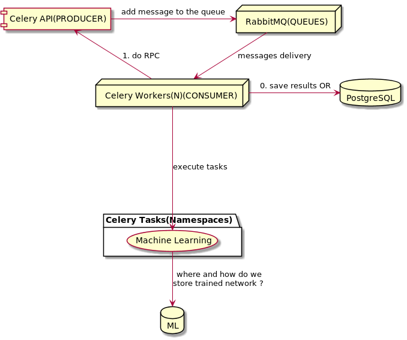

# messaging-with-rabbitmq
The aim of the project is to make a proof of concept for sentiment analyse(emotion AI) 
used for a chat with RabbitMQ as message broker. We want to recognize/show the emotions
of chat participants.

## concept

### generic view


### messaging

### ai


## technological stack
Python 3.6.8 + requirements.txt
RabbitMQ 3.8.3 Erlang 22.3.2
PostgreSQL 10.9
Celery 4.4.2


## development
In order to quickly run needed services we use docker and docker-compose.
Execute from main directory, it will run postgresql and rabbitmq containers.
```bash
./docker/up.sh
```

In order to build web client application.
Install dependencies.
```bash
npm install
```
Run webpack-dev-server.
```bash
npm run webpack-dev-server
```
Install python project in development mode.
```bash
pip install -e .
```
Run migrations.
```bash
mwr-manage migrate
```
Create superuser.
```bash
mwr-manage createsuperuser
```
Create dump data.
```bash
mwr-manage populate_with_dump_data
```
Run django project.
```bash
mwr-manage runserver
```

Run celery workers.
```bash
TODO
```

## test
After running docker-compose You should be able to run Celery and test script.

```bash
cd scripts
celery -A test worker --loglevel=info
```

```bash
cd scripts
python test.py
```

After that in Celery logs You will see a message that task was executed. PostgreSQL was used as
celery backend, You should see celery tables and existing records.